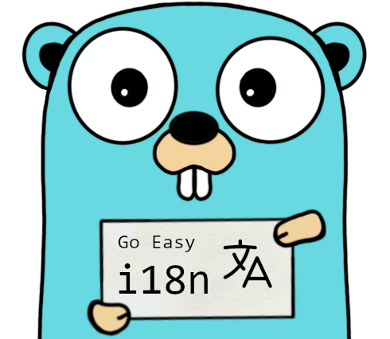

<p align="center">
	<a href="https://github.com/eduardolat/goeasyi18n/actions" target="_blank" rel="noopener">
		
	</a>
	<a href="https://github.com/eduardolat/goeasyi18n/releases" target="_blank" rel="noopener">
		
	</a>
	<a href="https://pkg.go.dev/github.com/eduardolat/goeasyi18n" target="_blank" rel="noopener">
		
	</a>
</p>

# Go Easy i18n



<br/>

Effortlessly simple i18n for Go. Plurals, gender, and more made easy!

- 🚀 Making Internationalization a Breeze in Go!
- 🔥 Simple yet flexible i18n library for Go developers.
- 📦 Supports pluralization, gender, and more with zero hassle!
- 👩‍💻 Perfect for projects that need quick and easy localization.
- 🚫 No weird or complicated usage. Just simple and easy to use.
- 🌍 Go global, the easy way!

## Installation 📦

```bash
go get github.com/eduardolat/goeasyi18n
```

## QuickStart 🚀

```go
package main

import (
	"fmt"

	"github.com/eduardolat/goeasyi18n"
)

func main() {
	// 1. Create a new i18n instance
	// You can skip the goeasyi18n.Config{} entirely if you are
	// ok with the default values.
	i18n := goeasyi18n.NewI18n(goeasyi18n.Config{
		FallbackLanguageName: "en", // It's optional, the default value is "en"
		DisableConsistencyCheck: false, // It's optional, the default value is false
	})

	// 2. Add languages and its translations (can be loaded from a JSON/YAML file)
	// using bytes, strings, files or fs.FS (embed.FS)
	i18n.AddLanguage("en", goeasyi18n.TranslateStrings{
		{
			Key:     "hello_message",
			Default: "Hello, welcome to Go Easy i18n!",
		},
	})

	i18n.AddLanguage("es", goeasyi18n.TranslateStrings{
		{
			Key:     "hello_message",
			Default: "¡Hola, bienvenido a Go Easy i18n!",
		},
	})

	// 3. You are done! 🎉 Just get that translations!
	t1 := i18n.Translate("en", "hello_message", goeasyi18n.Options{})
	t2 := i18n.Translate("es", "hello_message") // You can skip the options if you don't need them

	fmt.Println(t1)
	fmt.Println(t2)

	/*
		Prints:
		Hello, welcome to Go Easy i18n!
		¡Hola, bienvenido a Go Easy i18n!
	*/
}
```

## Learn Go ***(Easy i18n)*** by Examples 📚

This is the complete list of examples that covers **all** the features of Go Easy i18n from the most basic to the most advanced usage. If you want to be a pro, you should read them all!

Combining these features you can go as simple or complex as you want.

**Tip:** Read it in order, from top to bottom.

- [Basic Usage](/examples/01-basic-usage/main.go)
- [Variable Interpolation](/examples/02-variable-interpolation/main.go)
- [Load translations from JSON/YAML](/examples/03-json-yaml-loaders/README.md)
- [Default Pluralization](/examples/04-default-pluralization/main.go)
- [Custom Pluralization](/examples/05-custom-pluralization/main.go)
- [Genders](/examples/06-genders/main.go)
- [Pluralized Genders](/examples/07-pluralized-genders/main.go)
- [Templating Usage](/examples/08-templating/README.md)
- [Advanced Example - Website](/examples/09-advanced-example/README.md)

You are done! 🎉🎉🎉

If you find this library useful, please 🙏 give it a star ⭐️ on [GitHub](https://github.com/eduardolat/goeasyi18n) and share it with your friends.

## FAQ ❓

### Why should I use this library?

This library makes internationalization in Go extremely simple and flexible. It supports pluralization, gender, and more, all without any hassle. It's designed to be easy to use, so you can go global without breaking a sweat.

### Am i enforced to build my project in a specific way?

No, this library is designed to be as flexible as possible. You can integrate it into your existing project structure without any major changes.

### How can i name my languages?

You have complete freedom to name your languages as you see fit. For example, you could use URLs like example.com/en or example.com/en-US to identify languages. However, you're responsible for extracting this segment from the URL and using it in your application.

### How can i name my translation files?

You can name your translation files however you like. The library is agnostic to file naming conventions.

### From where should i load my translations?

Translations can be loaded from any JSON or YAML file. You have the flexibility to create your own database or any other mechanism that generates these files, and then load them into the library.

### Custom Pluralization: Why is it useful?

Imagine you're building an app that shows the number of unread messages.
In English, you'd say "1 unread message" and "2 unread messages" - note the "s" at the end.
But what about languages where plural rules aren't so simple?

With custom pluralization, you can easily handle these cases without writing complex if-else
statements. Just define your plural rules once, and let the library do the heavy lifting!

This makes your code cleaner and your app more linguistically accurate. Win-win!

### Gender Handling: Why is it useful?

Let's say your app has a feature that says, "John liked your post" or "Emily liked your post."
In some languages, the verb "liked" might change based on the gender of the person who
liked the post.

Example:
- English: "He liked your post" vs "She liked your post"
- Spanish: "A él le gustó tu publicación" vs "A ella le gustó tu publicación"

With gender-specific translations, you can easily adapt the sentence structure to fit the
gender, making your app more linguistically accurate and inclusive.

No need for messy if-else statements to handle gender variations. Just set it up once, and
the library takes care of the rest!
